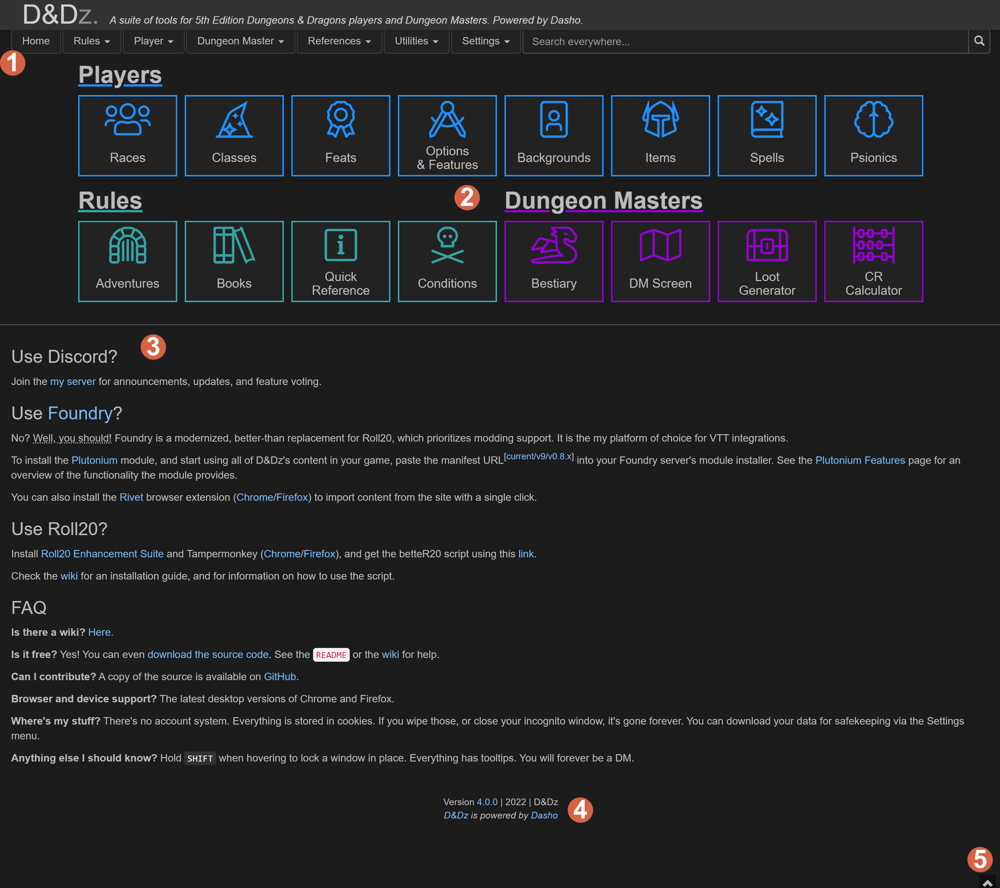

# Index

## Overview:

Below is an example of what your index screen should look like. It may look different depending on whether or not you have _Night mode_ turned on, and _Wide mode_ turned on.

### 1: Menu Bar

The menu bar has 3 points of interest. These are the _Title_, the _Navigation_, and the _Search Box_.

* **The Title** states the page you are on and what it does. For the _Index_ page it merely names and explains the service.
* **The Navigation** row allows you to navigate to every other page there is. Ones with a :arrow\_down\_small: symbol are pressable and have submenus.
*   **The Search Box** is a truly powerful feature where you can type in anything (any creature, class, feat, spell, tool, condition, adventure, character, location, ...) that exists in the D\&D 5e universe/game. In addition, you can narrow down your searches with search syntax.\

    The following search syntax is available:

    * `in:<category>` where `<category>` can be "spell", "item", "bestiary", etc.
    * `source:<abbreviation>` where `<abbreviation>` is an abbreviated source/book name ("PHB", "MM", etc.)
    * `page:<number>` or `page:<rangeStart>-<rangeEnd>`

### 2: Quick Launch Icons

The quick launch icons are an array of the most used pages of the service, arranged by relevance to Player, Dungeon Master, or both as rules. Simply click on tile, and get whisked away!

### 3: Service Information

The remainder of the page primarily explains the service you have landed on, while providing more technical information as well. Here you can see my [Discord server](https://discord.gg/yM7YGrT) for the service, along with information on Foundry, BetteR20, our Wiki and also our Source Code.

### 4: Footer

Version number and author information.

### 5: Dice Roller

The Dice Roller is on every page. You can use the roller to generate results of random dice rolls or roll combinations, such as `3d6+10` , which will roll three six sided dice, sum them up, and add ten to the result. You can use the `/help` command to learn more about it.
